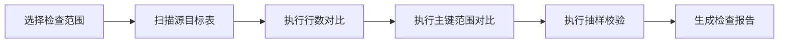

# 数据检查

数据检查用于在迁移前后确认源库和目标库的数据一致性。MVP 阶段建议先实现表级行数对比、主键范围对比和抽样校验。

## 检查目标

数据检查需要回答三个问题：

1. 源库和目标库表是否都存在？
2. 表数据量是否一致？
3. 关键数据是否有明显差异？

## 检查项

| 检查项 | MVP | 说明 |
| --- | --- | --- |
| 表存在性 | 是 | 源库有表，目标库也应该有表 |
| 行数对比 | 是 | 快速发现明显缺失 |
| 主键范围 | 是 | 对比 `min(pk)` 和 `max(pk)` |
| 抽样校验 | 建议 | 按主键抽样比较整行 hash |
| 分片 checksum | 后续 | 大表按主键范围分片 |
| 增量延迟 | 后续 | 配合逻辑复制状态 |
| DDL 差异 | 后续 | 对比字段、类型、索引、约束 |
| 数据库对象检查 | 后续 | 对比触发器、函数、视图、扩展等对象 |

## 行数对比

```sql
SELECT count(*) FROM public.users;
```

行数对比简单直接，但对于大表可能较慢。可以支持：

- 精确行数
- 估算行数

估算行数：

```sql
SELECT
  n.nspname AS schema_name,
  c.relname AS table_name,
  c.reltuples::bigint AS estimated_rows
FROM pg_class c
JOIN pg_namespace n ON n.oid = c.relnamespace
WHERE c.relkind = 'r';
```

## 主键范围对比

对有单列主键的表，执行：

```sql
SELECT
  min(id) AS min_id,
  max(id) AS max_id,
  count(*) AS row_count
FROM public.users;
```

如果源库和目标库的行数一致，但主键范围不一致，需要标记风险。

## 抽样校验

对有主键的表，可按主键抽样：

```sql
SELECT *
FROM public.users
ORDER BY id
LIMIT 100;
```

更推荐根据主键范围做稳定抽样，然后计算 hash：

```sql
SELECT
  id,
  md5(row_to_json(t)::text) AS row_hash
FROM public.users t
WHERE id IN (1, 100, 1000);
```

注意：`row_to_json(t)::text` 可能受字段顺序和类型输出影响。MVP 可以接受，后续可以做字段级规范化。

## 检查结果模型

建议保存：

| 字段 | 说明 |
| --- | --- |
| `task_id` | 迁移准备任务 ID |
| `schema_name` | schema |
| `table_name` | 表名 |
| `check_type` | 检查类型 |
| `source_value` | 源库结果 |
| `target_value` | 目标库结果 |
| `status` | `passed` / `warning` / `failed` |
| `message` | 结果说明 |
| `started_at` | 开始时间 |
| `finished_at` | 结束时间 |

## 状态判断

| 场景 | 状态 |
| --- | --- |
| 源目标表都存在，行数一致 | `passed` |
| 行数不一致 | `failed` |
| 目标表不存在 | `failed` |
| 主键范围不一致 | `warning` 或 `failed` |
| 抽样 hash 不一致 | `failed` |
| 表太大且未做精确检查 | `warning` |

## 检查流程



## MVP 建议

第一版先实现：

1. 用户选择 schema 或表。
2. 系统自动识别主键。
3. 小表执行精确 `count(*)`。
4. 大表支持估算行数或后台异步精确检查。
5. 有主键表执行 `min(pk)`、`max(pk)`。
6. 可选抽样 hash。
7. 输出表级检查报告。

这样已经能覆盖大部分切换前风险。

## 后续增强

表数据检查稳定后，建议补充 [数据库对象检查](/object-check/)，覆盖触发器、函数、视图、索引、约束和扩展等对象差异。
