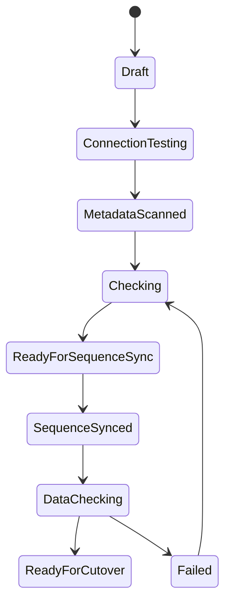

# MVP 范围

MVP 的目标不是一次性做完整迁移平台，而是先做出一个能真实帮助 PostgreSQL 迁移切换的工具。

当前优先级：

1. 一键设置目标库序列
2. 数据检查
3. 迁移前关键风险展示

## 用户场景

用户已经准备使用 PostgreSQL 原生逻辑复制或手动迁移方式完成数据同步，但在切换前需要确认：

- 目标库序列不会产生主键冲突
- 源库和目标库关键表数据一致
- 表的复制标识配置是否适合 UPDATE / DELETE 同步
- 当前迁移准备任务是否有明显风险

## 功能清单

| 模块 | 功能 | MVP |
| --- | --- | --- |
| 实例管理 | 保存 PostgreSQL 连接信息 | 是 |
| 实例管理 | 连接测试 | 是 |
| 元数据扫描 | 扫描 schema、table、sequence | 是 |
| Replica Identity | 展示表级模式 | 是 |
| Replica Identity | 展示 USING INDEX 对应索引 | 是 |
| 序列 | 获取源库序列当前值 | 是 |
| 序列 | 设置目标库序列步进值 | 是 |
| 序列 | 批量执行 `setval` | 是 |
| 数据检查 | 行数对比 | 是 |
| 数据检查 | 主键范围对比 | 是 |
| 数据检查 | 抽样校验 | 建议 |
| 任务 | 操作日志 | 是 |
| 任务 | 状态机 | 是 |
| 复制 | 创建 publication / subscription | 后续 |
| 复制 | 自研 WAL apply | 后期 |

## 状态机

## 第一版验收标准

第一版完成后，用户应该可以：

1. 新增源库和目标库实例。
2. 选择迁移准备任务涉及的 schema 或表。
3. 查看每张表的 `REPLICA IDENTITY` 模式。
4. 查看源库所有序列当前值和绑定字段。
5. 输入统一步进值，一键设置目标库序列。
6. 对源库和目标库执行数据检查。
7. 查看检查结果、风险项和操作日志。

## 非目标

MVP 不处理以下问题：

- 不自动同步 DDL。
- 不自动创建 publication / subscription。
- 不自动迁移数据。
- 不自研消费 WAL。
- 不做跨数据库类型迁移。
- 不自动修复业务冲突。
- 不提供强一致切换保证。

这些能力需要更复杂的状态管理、回滚机制和复制协议处理，适合放到后续版本。
