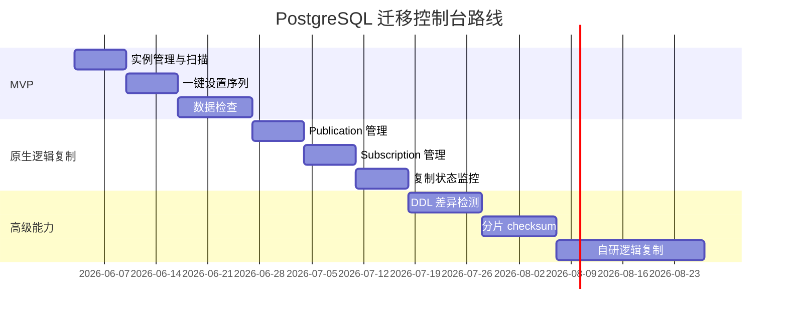

# 后续路线

后续路线围绕更完整的在线迁移能力展开。自研逻辑复制消费和 apply 建议放在后期，等 MVP 的实例管理、序列设置和数据检查稳定后再做。

## 第二阶段

建议加入：

- 创建 publication
- 创建 subscription
- 复制状态展示
- replication lag 监控
- replication slot WAL 保留量监控
- 切换前 checklist
- 迁移报告

## 第三阶段

建议加入：

- DDL 差异检测
- 字段类型对比
- 索引和约束对比
- 触发器、函数、视图、扩展对比
- 分片 checksum
- 大表并发检查
- 数据检查重试和断点续跑

## 后期：自研逻辑复制

自研逻辑复制可以提供更强的灵活性，但复杂度明显高于原生逻辑复制。

后期可以考虑：

- 消费 `pgoutput`
- 或使用 `wal2json`
- 自研 apply worker
- 支持数据过滤
- 支持字段映射
- 支持变更转换
- 支持跨版本兼容处理

## 自研复制的风险

需要重点处理：

- 事务顺序
- 幂等写入
- UPDATE / DELETE 定位
- DDL 变更
- 冲突处理
- 复制延迟
- 断点续传
- slot 清理
- WAL 堆积

因此不建议放入第一阶段。

## 推荐节奏

