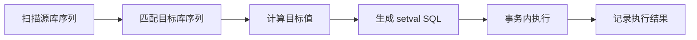

# 一键设置序列

序列是 PostgreSQL 迁移切换中最容易遗漏的问题之一。逻辑复制不会自动同步 sequence 当前值，如果目标库 sequence 值落后，切换后新增数据可能产生主键冲突。

MVP 应优先实现一键设置目标库序列。

## 功能目标

用户可以在切换前：

1. 扫描源库所有序列。
2. 查看序列与表字段的绑定关系。
3. 查看源库当前序列值。
4. 设置统一步进值。
5. 将 `源库当前值 + 步进值` 写入目标库。
6. 生成操作日志和执行结果。

## 展示字段

| 字段 | 说明 |
| --- | --- |
| `schema_name` | 序列所在 schema |
| `sequence_name` | 序列名 |
| `table_name` | 绑定表 |
| `column_name` | 绑定字段 |
| `last_value` | 当前值 |
| `increment_by` | 当前步长 |
| `cache_size` | 缓存大小 |
| `is_called` | 是否已经调用过 |
| `target_value` | 即将设置到目标库的值 |
| `status` | 检查或设置状态 |

## 源库序列扫描

```sql
SELECT
  seq_ns.nspname AS sequence_schema,
  seq.relname AS sequence_name,
  tbl_ns.nspname AS table_schema,
  tbl.relname AS table_name,
  col.attname AS column_name
FROM pg_class seq
JOIN pg_namespace seq_ns ON seq_ns.oid = seq.relnamespace
LEFT JOIN pg_depend dep
  ON dep.objid = seq.oid
  AND dep.deptype IN ('a', 'i')
LEFT JOIN pg_class tbl ON tbl.oid = dep.refobjid
LEFT JOIN pg_namespace tbl_ns ON tbl_ns.oid = tbl.relnamespace
LEFT JOIN pg_attribute col
  ON col.attrelid = tbl.oid
  AND col.attnum = dep.refobjsubid
WHERE seq.relkind = 'S'
  AND seq_ns.nspname NOT IN ('pg_catalog', 'information_schema');
```

获取序列运行时值可以使用：

```sql
SELECT * FROM public.users_id_seq;
```

或在 PostgreSQL 10+ 使用：

```sql
SELECT
  schemaname,
  sequencename,
  last_value,
  increment_by,
  cycle,
  cache_size
FROM pg_sequences
WHERE schemaname NOT IN ('pg_catalog', 'information_schema');
```

## 目标值计算

默认策略：

```text
target_value = source_last_value + step
```

例如：

| 源库当前值 | 步进值 | 目标库设置值 |
| --- | --- | --- |
| `95000` | `10000` | `105000` |
| `1200` | `5000` | `6200` |

## 设置目标库序列

执行 SQL：

```sql
SELECT setval('public.users_id_seq', 105000, true);
```

`is_called = true` 表示下一次 `nextval` 会返回大于当前设置值的值。

## 批量设置流程



## 异常处理

需要处理以下异常：

- 目标库缺少同名序列。
- 源库序列未绑定表字段。
- 目标库序列当前值已经大于计算值。
- 当前用户无权限执行 `setval`。
- 序列达到最大值或接近最大值。
- identity column 的内部序列需要正确识别。

## 安全策略

建议提供三个执行模式：

| 模式 | 说明 |
| --- | --- |
| 预览 | 只生成 SQL，不执行 |
| 单表执行 | 只设置指定表相关序列 |
| 批量执行 | 设置当前任务全部序列 |

批量执行前需要展示差异：

- 源库当前值
- 目标库当前值
- 计算后的目标值
- 是否会覆盖目标库更大的值

默认情况下，如果目标库当前值更大，不建议降低目标库序列。
